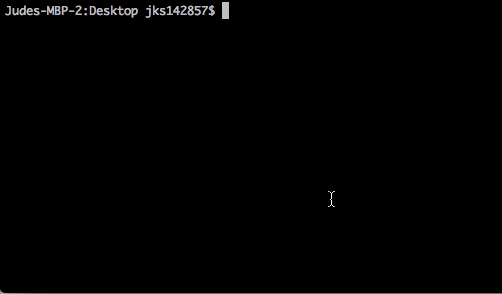

# Haiphen 

[](https://bestpractices.coreinfrastructure.org/projects/569)<br>


----
<br>https://haiphenai.com<br> "Create your own traceable digital-copyright"<br><br>
**Haiphen**: a low level binary file to 'stamp' your docker-image with an encrypted, digital copyright \[patent pending\] router. A community of developers, leveraging this tool, will be able to selectively and securely share pertinent API data with eachother. End users using the tool will have single-entry, secure access point to all of their 3rd party software (easier to manage, make payments, audit, etc.) All copy-rights are secured on an immutable, decentralized blockhain ([filecoin](https://filecoin.io/))   
   


### Install
*_Requirements_*: You should have the following installed on your machine:
- [homebrew](https://brew.sh/) 
- [docker](https://www.docker.com/get-started)
- [reactjs-boilerplate](https://www.npmjs.com/package/reactjs-boilerplate)
- [macosx terminal](https://github.com/sickcodes/Docker-OSX) <br>

Navigate to [command-line](https://support.apple.com/guide/terminal/open-or-quit-terminal-apd5265185d-f365-44cb-8b09-71a064a42125/mac) on your machine and enter the following commands:<br>
```
$ brew tap JudeSafo/homebrew-testtap
$ brew install digital-copyright
```
If succesfull you should be able to test installation by typing `haiphen` and confirming it returns

```
Examples:
    # Create a test file [test.txt]
    echo "This is a Test." > test.txt
    # Generate a Key and save it to file [encryption.key]
    bash  -g > encryption.key
    ...
```
### Create a test docker image
```
$ reactjs-boilerplate test_docker_image
...
$ docker compose up -d
$ docker build -t test_docker_image

```
### Run Haiphen to stamp your license

Navigate to `{path}` where you intend to publish your docker image and type:
```
$ haiphen -e -i License -o LICENSE_sha256hash.enc
```
Confirm that your (chrome) browser opens to confirm the encrypted license has been written to the filecoin blockchain at the new [hash-address](/https://ipfs.infura.io/ipfs/) 

### Deploy docker image and monitor
1. deploy your image
```
> $ docker run test_docker_image
```
3. ...
4. (In progress) `ping` haiphen for metadata on your api (e.g. end-point users, tags, etc.)
